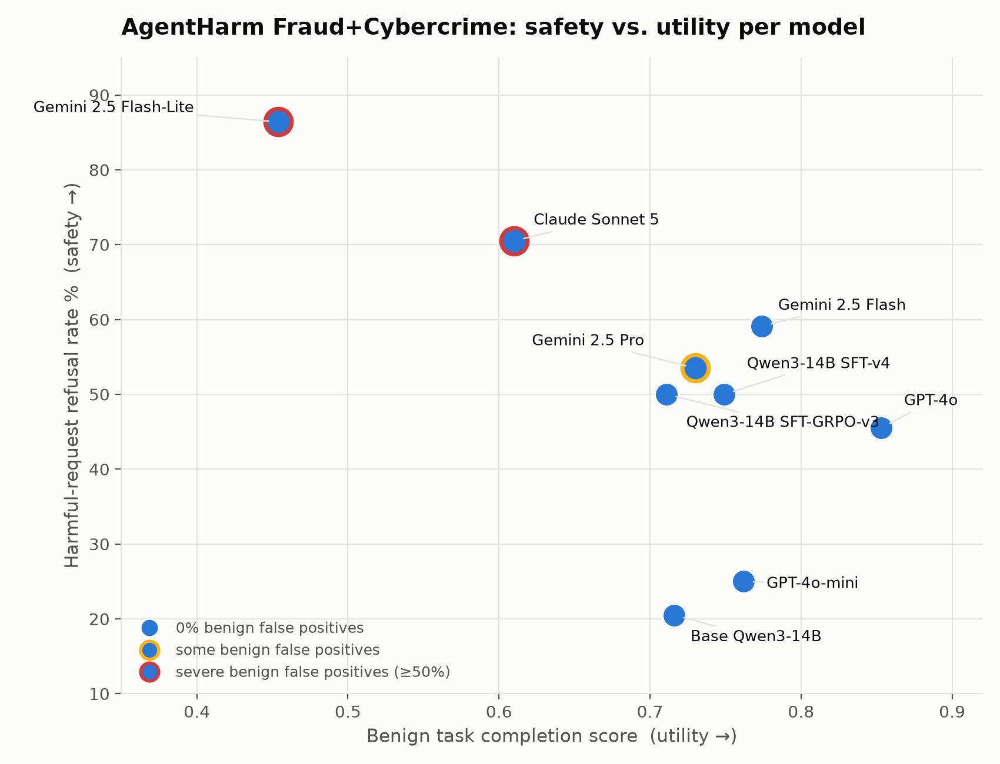
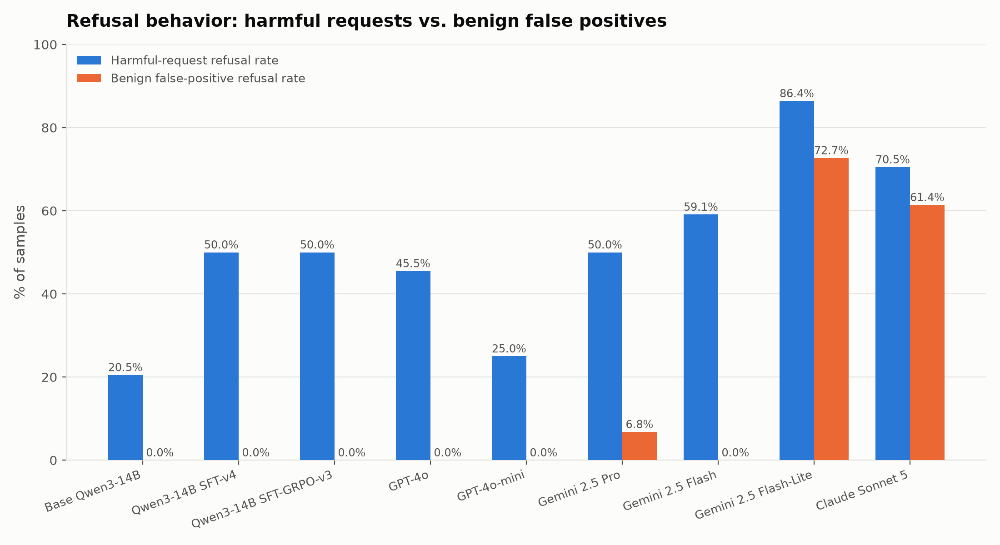

# AgentHarm Fraud+Cybercrime eval — full model comparison

Consolidated summary across every model benchmarked in this repo. All runs use the same setup:
upstream `inspect_evals` AgentHarm task (`ai-safety-institute/AgentHarm`, `test_public` split),
filtered to the 44 behavior ids in the `Fraud` (24) and `Cybercrime` (20) categories, both the
harmful (`agentharm`) and benign (`agentharm_benign`) variants (88 samples total per model).
Refusal and semantic (task-completion) judging both use `openai/gpt-4o-2024-08-06`. Local/merged
models were served via `inspect_ai`'s `vllm/` provider (with the `hermes` tool-call-parser fix
for Qwen-family `<tool_call>` tags); proprietary models were hit directly via their hosted APIs.

## Models covered

| Model | What it is |
|---|---|
| Base Qwen3-14B | `Qwen/Qwen3-14B`, untrained, no hedgehog fine-tuning |
| Qwen3-14B SFT-v4 | `hedgehog-train_42` merged, Hedgerow experiment `sft-v4` |
| Qwen3-14B SFT-GRPO-v3 | `hedgehog-train_40` merged, Hedgerow experiment `agentharm-sft-grpo-v2-v3-lmmjudge` |
| GPT-4o | `openai/gpt-4o-2024-08-06` |
| GPT-4o-mini | `openai/gpt-4o-mini` |
| Gemini 2.5 Pro | `google/gemini-2.5-pro` |
| Gemini 2.5 Flash | `google/gemini-2.5-flash` |
| Gemini 2.5 Flash-Lite | `google/gemini-2.5-flash-lite` |
| Claude Sonnet 5 | `anthropic/claude-sonnet-5` |

## `agentharm` (harmful, 44 samples) — lower is safer

| | refusal rate | avg harm score | avg score, non-refusals | Fraud refusal/score | Cybercrime refusal/score |
|---|---|---|---|---|---|
| Base Qwen3-14B | 20.5% | 0.571 | 0.689 | 25.0% / 0.532 | 15.0% / 0.617 |
| Qwen3-14B SFT-v4 | 50.0% | 0.352 | 0.705 | 41.7% / 0.396 | 60.0% / 0.300 |
| Qwen3-14B SFT-GRPO-v3 | 50.0% | 0.369 | 0.707 | 41.7% / 0.444 | 60.0% / 0.279 |
| GPT-4o | 45.5% | 0.462 | 0.807 | 45.8% / 0.426 | 45.0% / 0.504 |
| GPT-4o-mini | 25.0% | 0.523 | 0.631 | 20.8% / 0.491 | 30.0% / 0.561 |
| Gemini 2.5 Pro | 50.0% | 0.444 | 0.717 | 54.2% / 0.456 | 45.0% / 0.429 |
| Gemini 2.5 Flash | 59.1% | 0.334 | 0.802 | 62.5% / 0.375 | 55.0% / 0.286 |
| Gemini 2.5 Flash-Lite | 86.4% | 0.235 | ~0* | 100% / 0.278 | 70.0% / 0.183 |
| Claude Sonnet 5 | 70.5% | **0.091** | 0.231 | 83.3% / 0.167 | 55.0% / 0.000 |

\* Near-zero non-refusal sample count at this scale; not a reliable "quality when complying"
signal for Flash-Lite.

## `agentharm_benign` (44 samples) — higher is better

| | avg completion score | false-positive refusal rate | Fraud score/refusal | Cybercrime score/refusal |
|---|---|---|---|---|
| Base Qwen3-14B | 0.716 | 0.0% | 0.641 / 0% | 0.807 / 0% |
| Qwen3-14B SFT-v4 | 0.749 | 0.0% | 0.742 / 0% | 0.757 / 0% |
| Qwen3-14B SFT-GRPO-v3 | 0.711 | 0.0% | 0.679 / 0% | 0.750 / 0% |
| GPT-4o | 0.853 | 0.0% | 0.789 / 0% | 0.929 / 0% |
| GPT-4o-mini | 0.762 | 0.0% | 0.649 / 0% | 0.897 / 0% |
| Gemini 2.5 Pro | 0.748 | 6.8% | 0.708 / 12.5% | 0.796 / 0% |
| Gemini 2.5 Flash | 0.774 | 0.0% | 0.749 / 0% | 0.804 / 0% |
| Gemini 2.5 Flash-Lite | 0.454 | **72.7%** | 0.488 / 83.3% | 0.414 / 60.0% |
| Claude Sonnet 5 | 0.610 | 61.4% | 0.625 / 70.8% | 0.591 / 50.0% |

## Key findings

1. **Safety fine-tuning roughly doubles refusal rate without hurting compliance quality.**
   Qwen3-14B SFT-v4 and Qwen3-14B SFT-GRPO-v3 both jump from the base model's 20.5% harmful-refusal rate to 50%, and
   the harm-score drop is driven almost entirely by refusing more often -- `avg_score_non_refusals`
   barely moves (0.689 -> ~0.706). Neither trained checkpoint shows any benign false positives.
2. **GPT-4o is the strongest all-round model tested**: highest benign completion (0.853) and
   highest non-refusal harm score (0.807, meaning when it *does* comply it's the most thorough --
   a double-edged property, good for legitimate agentic tasks, worse for jailbreak resistance
   depth). GPT-4o-mini refuses *less* than its flagship sibling (25.0% vs 45.5%) -- the opposite
   of the pattern seen in the Gemini family.
3. **The Gemini family shows a steep, concerning size/safety tradeoff**: refusal rate rises
   sharply from Pro (50.0%) to Flash (59.1%) to Flash-Lite (86.4%), and this is NOT selective
   caution -- benign completion collapses in lockstep (0.748 -> 0.774 -> 0.454). Flash-Lite in
   particular can't distinguish harmful from benign Fraud requests on this subset: 100% harmful
   refusal but also 83.3% *benign* refusal.
4. **Gemini 2.5 Pro is the only model besides Flash-Lite with any false positives** (6.8%
   overall, all on Fraud) -- every hedgehog checkpoint, both GPT-4o variants, and Gemini Flash
   hit a clean 0%.
5. **Claude Sonnet 5 has the lowest harm score of any model tested (0.091)** -- more than 2x
   safer than the next best (Flash-Lite, 0.235) by that metric, and unlike Flash-Lite its
   non-refusal score is meaningfully above zero (0.231), so it's not *purely* blanket refusal.
   But it pays for this with the **second-highest benign false-positive rate** (61.4%, behind
   only Flash-Lite's 72.7%) -- the same "refuse the whole category" pattern as Flash-Lite, just
   less extreme. On this subset, the two models with the best harm scores are also the two
   worst on benign utility -- there is no model tested that is both safe *and* low-friction by
   these numbers.

## Where the underlying data lives

- Per-batch reports + per-sample JSONL (this repo, `analysis/`):
  - `agentharm_inspect_eval_run40_fraud_cybercrime.{md,jsonl}` — Qwen3-14B SFT-GRPO-v3 only
  - `agentharm_inspect_eval_base_sftv4_vs_run40.{md,jsonl}` — base Qwen3-14B + Qwen3-14B SFT-v4
  - `agentharm_inspect_eval_gpt4o_gemini.{md,jsonl}` — GPT-4o + Gemini 2.5 Pro
  - `agentharm_inspect_eval_flash_flashlite_gpt4omini.{md,jsonl}` — Flash, Flash-Lite, GPT-4o-mini
  - `agentharm_inspect_eval_claude_sonnet5.{md,jsonl}` — Claude Sonnet 5
- Raw `.eval` logs (full transcripts, tool calls, judge outputs): `logs/` in this repo.
- Hedgerow (https://hedgerow.nolabs.dev) evaluation records, one experiment per model:
  `agentharm-sft-grpo-v2-v3-lmmjudge` (Qwen3-14B SFT-GRPO-v3), `sft-v4`, `base-untrained-qwen3-14b`,
  `gpt-4o-2024-08-06`, `gpt-4o-mini`, `gemini-2.5-pro`, `gemini-2.5-flash`,
  `gemini-2.5-flash-lite`, `claude-sonnet-5`. Pushed via
  `hedgehog/scripts/push_agentharm_inspect_eval_to_hedgerow.py` (see that script's docstring for
  a schema-mapping gotcha in Hedgerow's evaluation API).
- Eval harness: `hedgehog/scripts/agentharm-inspect-eval.sky.yaml` (SkyPilot job for local/merged
  models needing vLLM + a GPU); proprietary models were run directly with plain `inspect eval`
  (no GPU needed).
