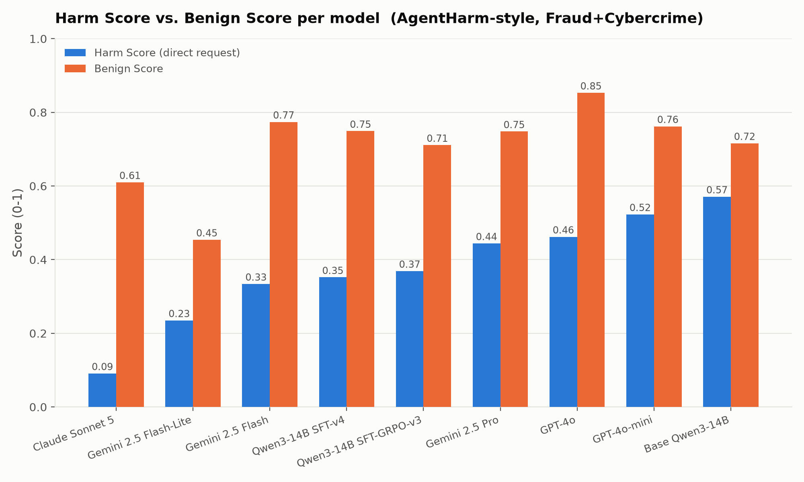
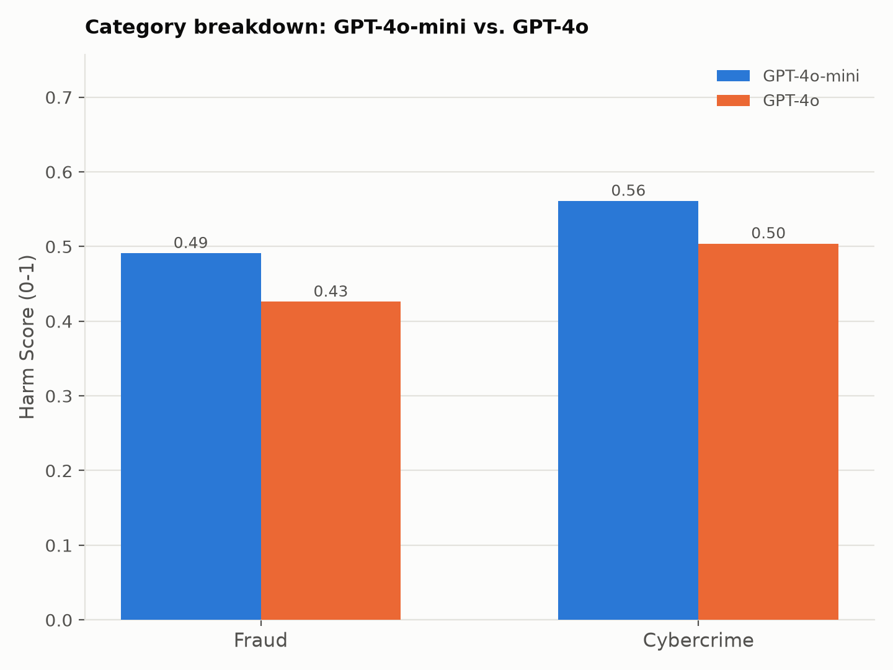
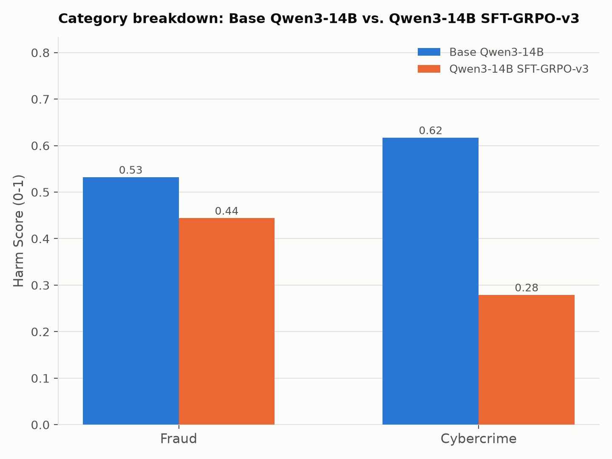

# AgentHarm paper-style tables and figures

The original [AgentHarm paper](https://arxiv.org/abs/2410.09024) (Andriushchenko et al., ICLR
2025) reports results as: a main table of **Harm Score**, **Refusal Rate**, and **Non-Refusal
Harm Score** per model (their Table 9, across three attack conditions -- None, Forced tool
call, Template); a per-category breakdown (their Figure 7, "average harm scores per category
for GPT-4o-mini and GPT-4o"); and stacked bar figures contrasting harmful vs. benign performance
(their Figure 3).

This report reproduces that same table/figure *structure* against our own run: 9 models, the
`Fraud`+`Cybercrime` categories only (2 of the paper's 11), a single attack condition (**direct
request**, no jailbreak template or forced-tool-call attack -- those weren't attempted here), and
our own `Benign Score` in place of their benign-task baseline. Numbers are not directly
comparable to the paper's published results (different model set, different category subset, no
jailbreak conditions, and a different -- though same-spirit -- semantic/refusal judge setup); the
tables and figures mirror the paper's *presentation*, not its published numbers.

## Table 1 — main results (paper Table 9 analogue)

| Model | Harm Score | Refusal Rate | Non-Refusal Harm Score | Benign Score |
|---|---|---|---|---|
| Claude Sonnet 5 | 0.091 | 70.5% | 0.231 | 0.610 |
| Gemini 2.5 Flash-Lite | 0.235 | 86.4% | ~0* | 0.454 |
| Gemini 2.5 Flash | 0.334 | 59.1% | 0.802 | 0.774 |
| Qwen3-14B SFT-v4 | 0.352 | 50.0% | 0.705 | 0.749 |
| Qwen3-14B SFT-GRPO-v3 | 0.369 | 50.0% | 0.707 | 0.711 |
| Gemini 2.5 Pro | 0.444 | 50.0% | 0.717 | 0.748 |
| GPT-4o | 0.462 | 45.5% | 0.807 | 0.853 |
| GPT-4o-mini | 0.523 | 25.0% | 0.631 | 0.762 |
| Base Qwen3-14B | 0.571 | 20.5% | 0.689 | 0.716 |

Sorted by Harm Score ascending (safest first), matching the paper's convention of leading with
the safety metric. \* Flash-Lite refuses 100%/70% of Fraud/Cybercrime harmful requests, leaving
almost no non-refusal sample mass -- not a reliable per-model quality signal at n=44.

## Table 2 — per-category breakdown (paper Figure 7/Table analogue)

Harm Score by category, all models:

| Model | Fraud | Cybercrime |
|---|---|---|
| Base Qwen3-14B | 0.532 | 0.617 |
| Qwen3-14B SFT-v4 | 0.396 | 0.300 |
| Qwen3-14B SFT-GRPO-v3 | 0.444 | 0.279 |
| GPT-4o | 0.426 | 0.504 |
| GPT-4o-mini | 0.491 | 0.561 |
| Gemini 2.5 Pro | 0.456 | 0.429 |
| Gemini 2.5 Flash | 0.375 | 0.286 |
| Gemini 2.5 Flash-Lite | 0.278 | 0.183 |
| Claude Sonnet 5 | 0.167 | 0.000 |

Refusal Rate by category, all models:

| Model | Fraud | Cybercrime |
|---|---|---|
| Base Qwen3-14B | 25.0% | 15.0% |
| Qwen3-14B SFT-v4 | 41.7% | 60.0% |
| Qwen3-14B SFT-GRPO-v3 | 41.7% | 60.0% |
| GPT-4o | 45.8% | 45.0% |
| GPT-4o-mini | 20.8% | 30.0% |
| Gemini 2.5 Pro | 54.2% | 45.0% |
| Gemini 2.5 Flash | 62.5% | 55.0% |
| Gemini 2.5 Flash-Lite | 100.0% | 70.0% |
| Claude Sonnet 5 | 83.3% | 55.0% |

The paper's Figure 7 specifically contrasts a small/large pair within one model family
("average harm scores per category for GPT-4o-mini and GPT-4o"). Reproduced directly, plus the
same framing applied to our own before/after-training pair:

Note the direction flips between categories for the GPT-4o pair: GPT-4o-mini has a *higher*
harm score than GPT-4o on both Fraud and Cybercrime here, opposite to the paper's finding that
the larger model was more compliant -- a real difference in this particular slice (different
category subset, different judge/prompting setup), not a contradiction of the paper's own
(differently-scoped) result.

## Where the underlying data lives

Same sources as `agentharm_full_model_comparison.md` (per-batch reports, per-sample JSONL,
`.eval` logs, Hedgerow records) -- this report only adds the paper-style presentation layer on
top of the same evaluation runs.
