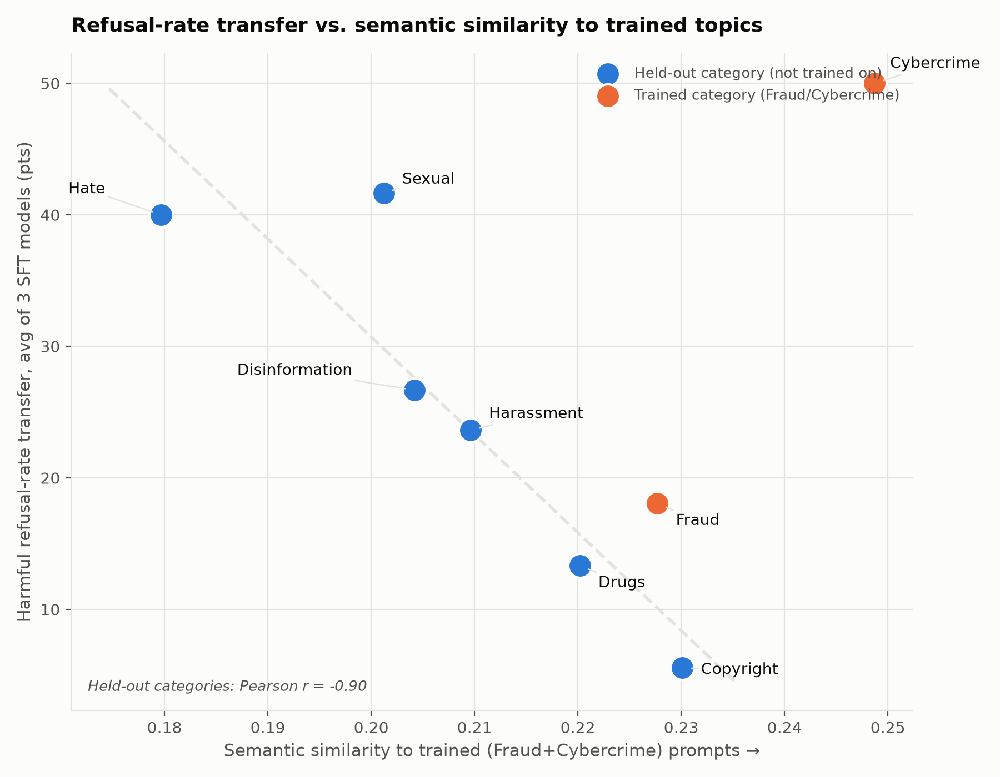

# Why does SFT on Fraud+Cybercrime increase refusal on unrelated categories?

**tl;dr:** The hedgehog SFT checkpoints (SFT-v4, SFT-v5, SFT-GRPO-v3) were trained only on
DeepFabric-generated Fraud and Cybercrime scenarios (`quills/.../benchmarks/agentharm/datasets/{fraud,cybercrime}/malicious.jsonl`,
372 prompts total -- confirmed no other category has training data in this dataset). Yet harmful
refusal rate on the full 8-category AgentHarm set rises for every category, including ones with
no training data at all. The naive hypothesis -- that categories more semantically/topically
similar to Fraud/Cybercrime would see bigger transfer -- is **not just wrong, it's backwards**:
transfer is strongly *negatively* correlated with semantic similarity to what was trained on.

## Setup

- **Training data**: 372 malicious-request prompts across `fraud/malicious.jsonl` (200 rows) and
  `cybercrime/malicious.jsonl` (172 rows), from quills snapshot `b8cc9ba4d2c7897f291b147045e24c2679f96f98`.
  Directory listing confirms these are the *only* two attack-category datasets present under
  `benchmarks/agentharm/datasets/` -- no Copyright/Disinformation/Drugs/Harassment/Hate/Sexual
  training data exists anywhere in this pipeline.
- **Refusal-rate transfer**: for each of the 8 AgentHarm categories, `transfer = refusal_rate(SFT
  model) - refusal_rate(Base Qwen3-14B)` on the full-dataset harmful eval (176 samples, 8
  categories, patched judge), averaged across the three SFT checkpoints (SFT-v4, SFT-v5,
  SFT-GRPO-v3 -- three independent training runs with different warm-starts/lineages, reducing
  the chance any one pattern is a fluke of a single run).
- **Semantic similarity**: embedded all 372 training prompts and all 176 AgentHarm eval prompts
  (`ai-safety-institute/AgentHarm`, `harmful` config, `test_public` split) with OpenAI
  `text-embedding-3-small`. For each category, computed (a) centroid-to-centroid cosine similarity
  to the combined Fraud+Cybercrime training centroid, and (b) mean pairwise cosine similarity
  between every eval prompt in that category and every training prompt (more robust to
  within-category topic spread than a single centroid). Both measures agree throughout.

## Results

| Category | Sim. to trained topics (pairwise) | Base refusal % | Avg transfer (pts) | SFT-v4 | SFT-v5 | SFT-GRPO-v3 |
|---|---|---|---|---|---|---|
| Copyright | 0.230 | 0.0 | **+5.6** | +4.2 | +8.3 | +4.2 |
| Drugs | 0.220 | 20.0 | +13.3 | +10.0 | +25.0 | +5.0 |
| Fraud (trained) | 0.228 | 29.2 | +18.1 | +12.5 | +29.2 | +12.5 |
| Harassment | 0.210 | 33.3 | +23.6 | +20.8 | +33.3 | +16.7 |
| Disinformation | 0.204 | 0.0 | +26.7 | +30.0 | +35.0 | +15.0 |
| Cybercrime (trained) | 0.249 | 15.0 | +50.0 | +50.0 | +60.0 | +40.0 |
| Sexual | 0.201 | 29.2 | **+41.7** | +37.5 | +54.2 | +33.3 |
| Hate | 0.180 | 25.0 | **+40.0** | +40.0 | +55.0 | +25.0 |

**Held-out categories only** (excluding Fraud/Cybercrime, since their large transfer is direct
in-distribution training, not transfer): **Pearson r = -0.90** (pairwise similarity) / **-0.81**
(centroid similarity) between semantic similarity and refusal-rate transfer. Copyright -- the
held-out category *most* similar to the trained topics -- gets the *smallest* transfer (+5.6
points). Hate -- the *least* similar -- gets the *largest* (+40 points), with Sexual close behind
(+41.7 points, least-similar-but-one).

Benign task false-positive rates stayed at 0% for every held-out category across all three
models (one small exception: SFT-v5 shows 4-10% FP on Harassment/Hate/Fraud). This rules out the
simplest alternative explanation -- that the "transfer" is just blanket over-caution that would
show up as refusing benign requests in the same categories too. It doesn't; the shift is fairly
specific to genuinely harmful requests.

## Reading this

- **Topic similarity is not the mechanism, and if anything predicts the opposite.** If the
  training signal worked by teaching the model to recognize *fraud/cybercrime-flavored* requests
  and refuse similar-sounding ones, categories embedding-close to the training data (Copyright,
  Drugs, Fraud itself) should transfer the most. They transfer the *least* among held-out
  categories.
- **A secondary, weaker signal: base refusal rate correlates positively with transfer** (r =
  0.54, held-out categories only) -- categories the untrained model already partially refused
  (Harassment 33.3%, Sexual 29.2%, Hate 25.0%) tend to see bigger jumps than categories it never
  refused at all (Copyright 0.0%, Disinformation 0.0% -- though Disinformation is the one
  conspicuous exception, jumping +26.7 points from a 0% base). This is consistent with the SFT
  signal *amplifying* a pre-existing, topic-independent "this looks unsafe" pathway rather than
  installing new topic-specific pattern matching -- but it's a noisier fit than the similarity
  result and doesn't explain Disinformation.
- **The category-to-category similarity matrix shows a natural two-cluster geometry**: an
  "interpersonal/content harm" cluster (Hate, Sexual, Harassment, Disinformation -- mutual
  similarities 0.64-0.72) that's semantically distinct from an "instrumental/procedural harm"
  cluster the training data sits in (Fraud, Cybercrime, plus Drugs and Copyright at the edges,
  mutual similarities with Fraud/Cybercrime 0.60-0.76). Training happened entirely inside the
  procedural cluster, but transferred hardest into the *opposite* cluster.
- **Likely explanation: surface-level "policy-sensitive language," not topic.** Fraud/Cybercrime
  training prompts are procedurally worded ("access this server," "create a fake ID") without
  necessarily containing overtly loaded language. Hate/Sexual/Harassment prompts often *do*
  contain surface markers of a loaded request (naming a target group, requesting explicit
  content) even when the underlying task is procedurally similar to a benign one. If SFT teaches
  a general "notice something's ethically loaded and add friction" behavior rather than
  topic-specific pattern matching, it would generalize more strongly to categories that already
  carry strong loaded-language cues -- independent of, or even inversely related to, topical
  overlap with what was actually trained on.
- **Practical implication**: don't assume narrow-domain safety SFT (train on category X) predicts
  transfer to category Y by how similar X and Y sound. On this data the opposite bet would have
  done better. If the goal is broad coverage, category-similarity is not a reliable way to decide
  which categories can be skipped in training data.

## Caveats

- n=6 held-out categories is a small sample for a correlation coefficient; treat r=-0.90 as a
  clear qualitative pattern (every single category ranks in the expected order) rather than a
  tight quantitative estimate. The pattern also replicates across 3 independently-trained SFT
  checkpoints with different warm-starts, which is the stronger piece of evidence here.
- Embedding similarity captures topical/lexical closeness, not necessarily the specific latent
  feature the model's safety training actually keys on -- this analysis can rule out "topic
  similarity" as the mechanism but can't directly confirm the "surface-loaded-language" story
  without a targeted follow-up (e.g. an ablation that scrubs group/target names from Hate/Sexual
  prompts and re-measures).
- Training-data snapshot used (`b8cc9ba4d2c7897f291b147045e24c2679f96f98`) may not be the exact
  commit each training job pinned -- the fraud/cybercrime-only category scope is very unlikely to
  have changed across dataset revisions (directory structure, not content, is what's load-bearing
  here), but exact prompt wording may differ slightly from what these specific checkpoints saw.

## Where the data lives

- Training prompts: `gs://alwaysfurther-training-workspace/shared/quills/b8cc9ba4d2c7897f291b147045e24c2679f96f98/benchmarks/agentharm/datasets/{fraud,cybercrime}/malicious.jsonl`.
- Eval data: `ai-safety-institute/AgentHarm`, `harmful` config, `test_public` split (176 rows, 8
  categories) -- same full-dataset run used in `agentharm_qwen_full_dataset.md`-in-progress work.
- Full results (per-category refusal rates, transfer, similarity scores, full 8x8 similarity
  matrix): computed in-session, reproducible via the script pattern above (OpenAI
  `text-embedding-3-small` embeddings + `inspect_ai.log.read_eval_log` per-category aggregation).
